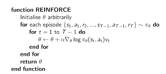

# banana-navigator

Reinforcement Learning agent trained to navigate and collect bananas using Policy Gradient methods

## Learning Algorithm
REINFORCE (Monte-Carlo policy gradient) relies on an estimated return by Monte-Carlo methods by sampling episodes to update θ (policy).

To solve the Navigator:Bananas environment, I have implemented this method with T = 1000 (timesteps in an episode). The algorithm runs for a number of episodes (max 5000) till the average score of the last 100 episodes is less than 13.0. Gamma=0.92 was used, with Adam Optimizer learning rate = 3e-3.

## Network Architecture
The agent’s policy network is a simple 2-layered neural network, with 16 neurons in each layer (linear layers).
Input layer has 37 neurons (state size), output layer has 4 neurons (action size)
Relu activation function is used between the layers. 
Softmax has been used at the output layer.

  

## Results
The target score of 13.0 was reached in 1523 episodes. 
(Average Score = 13.10).

The Score v/s #episodes graph is shown below.

  

The average score over sets of 100 episodes is shown below.

  

## Extensions
This project can be extended with implementations of other Reinforcement Learning Algorithms such as DQN, DDQN, SARSA, Temporal Learning, Q-Learning, Actor-Critic Methods, etc, to see which RL algorithm gives the best result for the same environment.
Performance of the algorithm can also be tested out on other environments such as CartPole.

